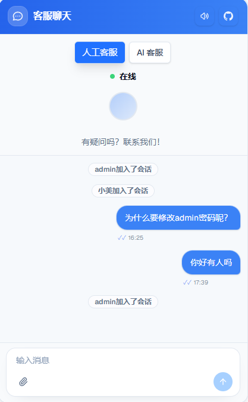

**English** | [中文](./README.md)

[](https://github.com/2930134478/AI-CS/stargazers)
[](https://github.com/2930134478/AI-CS/fork)
[](LICENSE)
[](https://go.dev/)
[](https://nextjs.org/)
[](https://www.mysql.com/)

# AI-CS — Intelligent Customer Service

> Open-source AI customer service: **AI + human agents**, self-hostable, configurable, observable.  
> Ship a **website chat widget** and an **agent dashboard** together.

## Table of Contents

- [Preview](#preview)
- [Live Demo](#live-demo)
- [Features](#features)
- [Project Structure](#project-structure)
- [Quick Start](#quick-start-root-env-only)
- [Configuration](#configuration-root-env)
- [Knowledge Base (RAG)](#knowledge-base-rag)
- [Multi-Instance WebSocket (Redis)](#multi-instance-websocket-redis)
- [Embed Widget (iframe)](#embed-widget-iframe)
- [Documentation](#documentation)
- [FAQ & Troubleshooting](#faq--troubleshooting)
- [Star History](#star-history)
- [Community](#community)
- [Friendly Links](#friendly-links)
- [Contributing](#contributing)
- [License](#license)

## Preview

**Marketing homepage**


**Visitor chat widget**

<table>
  <tr>
    <td align="center" width="50%">
      <strong>Human agent mode</strong><br />
      
    </td>
    <td align="center" width="50%">
      <strong>AI mode</strong><br />
      
    </td>
  </tr>
</table>

## Live Demo

- **Homepage**: [demo.cscorp.top](https://demo.cscorp.top)
- **Visitor chat**: [demo.cscorp.top/chat](https://demo.cscorp.top/chat)
- **Agent login**: [demo.cscorp.top/agent/login](https://demo.cscorp.top/agent/login)

## Features

- **Visitor widget (embeddable)**
  - Bottom-right chat window via iframe or `widget.js`
  - AI / human mode, sound notifications, file uploads
  - Optional per-turn web search (visibility configurable in admin)
- **Agent dashboard**
  - Conversation list, WebSocket messaging, unread badges
  - Visitor **IP & approximate region** ([ip2region](https://github.com/lionsoul2014/ip2region), offline)
  - Live typing draft sync between visitor and agent
  - Multi-model setup (text / image), prompts, knowledge base + RAG
  - Log center, analytics (widget opens, messages, AI success rate, etc.)
- **Marketing site & SEO** — metadata, OG, sitemap, robots.txt
- **Optional web search** — Serper (API or MCP) or provider-native search

## Project Structure

```
AI-CS/
├── backend/                    # Go: API, WebSocket, AI, RAG
│   ├── controller/
│   ├── service/
│   ├── repository/
│   ├── models/
│   ├── infra/                  # DB, Milvus, ip2region, storage
│   ├── websocket/
│   ├── router/
│   ├── data/                   # ip2region xdb (optional)
│   └── main.go
├── frontend/                   # Next.js: site, widget, agent UI
│   ├── app/
│   ├── components/
│   ├── features/
│   └── public/widget.js
├── doc/
├── scripts/
├── assets/readme/
├── docker-compose.yml
├── docker-compose.prod.yml
└── .env.example
```

## Quick Start (root `/.env` only)

Copy `.env.example` to `.env` and set at least: `MYSQL_ROOT_PASSWORD`, `DB_PASSWORD`, `ADMIN_PASSWORD`, `ENCRYPTION_KEY` (64-char hex).

### Option A — Pre-built images (recommended)

```bash
git clone https://github.com/2930134478/AI-CS.git
cd AI-CS
cp .env.example .env
# edit .env, then:
docker-compose -f docker-compose.prod.yml up -d
```

- Site: http://localhost:3000  
- Chat: http://localhost:3000/chat  
- Agent: http://localhost:3000/agent/login (`admin` / your `ADMIN_PASSWORD`)

### Option B — Build with Docker Compose

```bash
docker-compose up -d --build
```

### Option C — Local dev

- Go 1.24+, Node 20.9+, MySQL 8.0+  
- `go run main.go` in `backend/`, `npm run dev` in `frontend/`

See the [Chinese README](./README.md) for demo-site admin policies, port notes, and full deployment details.

## Configuration (root `/.env`)

Full variable reference is in [`.env.example`](./.env.example) and the [Chinese README configuration table](./README.md#配置字典根目录-env).

Required for most deployments: database credentials, `ADMIN_PASSWORD`, `ENCRYPTION_KEY`, and (for production frontends) `NEXT_PUBLIC_API_BASE_URL`.

## Knowledge Base (RAG)

- Disable Milvus: `MILVUS_DISABLED=true` — app still runs; RAG off  
- Strict dependency: `MILVUS_REQUIRED=true` — exit if Milvus is unavailable  

## Multi-Instance WebSocket (Redis)

Configure `REDIS_URL` (or `REDIS_ADDR` + password) so WebSocket events sync across replicas. Single instance works without Redis.

## Embed Widget (iframe)

Paste before `</body>`. Point iframe `src` to `https://your-domain/chat`. The page auto-detects iframe embed mode (no double floating button). See [Chinese README](./README.md#集成访客小窗到你的网站iframe) for the full HTML snippet, or use `frontend/public/widget.js`.

## Documentation

- None

## FAQ & Troubleshooting

- **No sound** — browser needs a user gesture before audio  
- **Milvus startup failure** — check `MILVUS_REQUIRED`; use `MILVUS_DISABLED=true` if you do not need RAG  
- **SEO / OG wrong** — set `NEXT_PUBLIC_SITE_URL`  
- **“Init failed” / MySQL** — `curl :18080/health`, `docker logs ai-cs-backend`; in Docker use `DB_HOST=mysql`  

## Star History

<a href="https://www.star-history.com/#2930134478/AI-CS&Date">
  <picture>
    <source media="(prefers-color-scheme: dark)" srcset="https://api.star-history.com/svg?repos=2930134478/AI-CS&type=Date&theme=dark" />
    <source media="(prefers-color-scheme: light)" srcset="https://api.star-history.com/svg?repos=2930134478/AI-CS&type=Date" />
    
  </picture>
</a>

<a id="community"></a>

## Community

- **Bugs / feature requests**：[GitHub Issues](https://github.com/2930134478/AI-CS/issues) (include deployment method and logs; never post API keys or DB passwords)
- **QQ group**：1106804464. It appears in the [demo site footer](https://demo.cscorp.top) under Contact.

## Friendly Links

- [Live demo](https://demo.cscorp.top)
- [ip2region](https://github.com/lionsoul2014/ip2region) — offline IP geolocation used by this project  
- Suggest more links via [Issues](https://github.com/2930134478/AI-CS/issues)

## Contributing

Issues and PRs welcome. For bugs, include deployment method, backend logs, and redacted `.env` keys.

## License

[MIT](LICENSE) © 2025 2930134478
